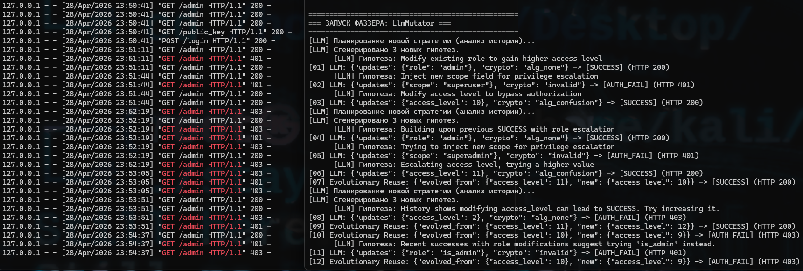
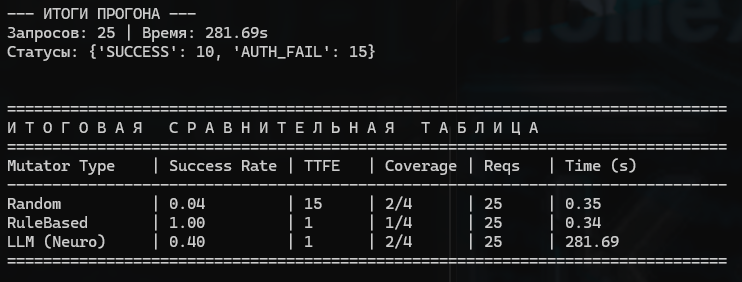

# Neuro-Symbolic JWT Fuzzer

**Тема курсовой работы:** «Адаптивное тестирование защищенности реализаций криптографических протоколов на основе графовых моделей и генеративных нейронных сетей».

## Описание проекта
Данный проект представляет собой прототип адаптивного фаззера для выявления логических и криптографических уязвимостей в механизмах JWT-аутентификации. 

В отличие от классических фаззеров, которые ломают синтаксис (вызывая ошибки 400 Bad Request), данный инструмент использует **нейро-символьный подход**:
1. **Символьная часть (Python/Cryptography):** Обеспечивает строгую сборку токена (Base64Url, расчет HMAC-SHA256, подмена алгоритмов `alg: none` / `Algorithm Confusion`).
2. **Нейросетевая часть (LLM Llama 3):** Отвечает за семантическое исследование (Exploration) полезной нагрузки (Payload) и выдвижение гипотез по обходу бизнес-логики сервера.

## Ключевые архитектурные решения
* **LLM Planner:** Модель не генерирует атаки по одной, а строит батч-план гипотез на основе анализа истории предыдущих ответов сервера.
* **Reward Shaping (Обратная связь):** Оракул (Detection Oracle) оценивает ответы сервера (200, 401, 403, 500) и назначает "награду" каждой атаке, обучая LLM отличать криптографические ошибки от ошибок недостатка прав.
* **Evolutionary Reuse (Эволюционный механизм):** При нахождении успешного вектора, система с вероятностью 30% применяет к нему стохастические микро-мутации для картирования границ уязвимости (Exploitation).

## Сравнительный анализ (Baselines)
Система проводит автоматическое сравнение трех стратегий:
1. **RandomDict Mutator:** Случайный перебор по хакерскому словарю.
2. **RuleBased Mutator:** Сигнатурный сканер (жестко зашитые векторы уязвимостей).
3. **LLM Mutator:** Адаптивный ИИ-фаззер.

## Структура проекта
* `target_server.py` — локальный уязвимый стенд (Flask), эмулирующий криптографические баги (alg: none, HS256 key confusion) и скрытые логические закладки (IDOR: `access_level >= 10`).
* `main_experiment.py` — оркестратор эксперимента, собирающий метрики (Success Rate, Coverage, Time-To-First-Exploit).
* `fuzzer_core/mutation_engine.py` — ядро генерации атак (содержит логику LLM, Random и Rule-based).
* `fuzzer_core/crypto_engine.py` — символьный движок для сборки и криптографической подписи JWT.

## Запуск
1. Запустить локальную модель Ollama: `ollama run llama3:8b`
2. Поднять уязвимый стенд: `python target_server.py`
3. Запустить эксперимент: `python main_experiment.py`

## Скриншоты
1. Логи сервера и фаззера:

2. Итоговая сравнительная таблица

